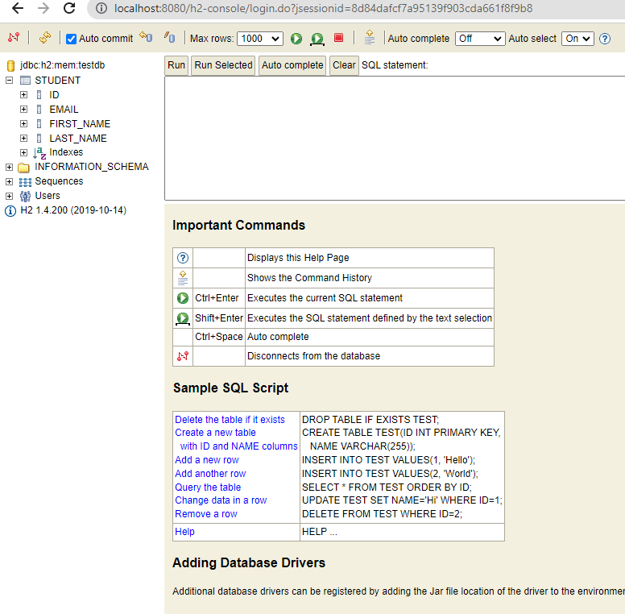

# Exercise - Spring Boot - Mock DB
* write a Spring Boot application with the necessary dependencies that:
  * mocks a database using `h2` that has `username`:`testdb` and `password`:`psw1234`
  * creates a table `Student` with:
    * a primary key
    * a `firstName`
    * a `lastName`
    * a unique `email`
* use the `h2-console` with your browser and connect to the db
  * you should see something like the following pic in the browser

